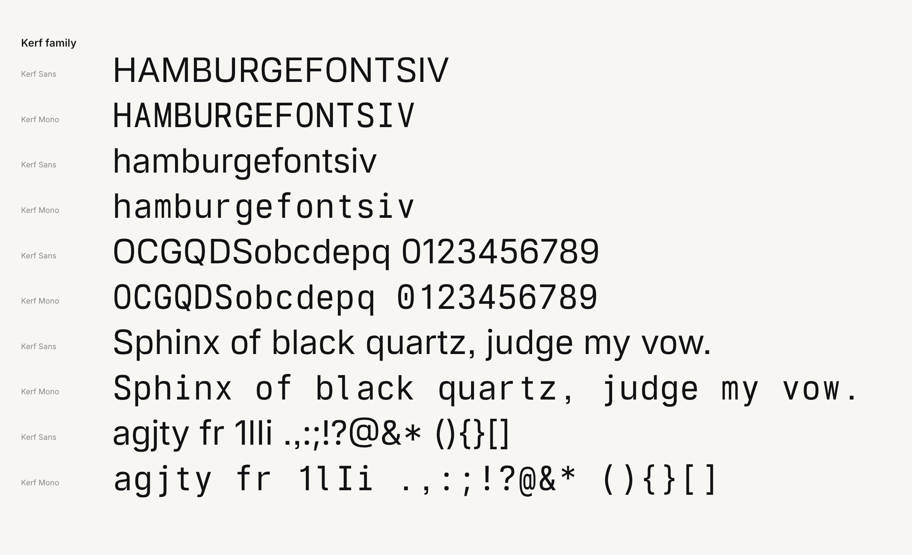
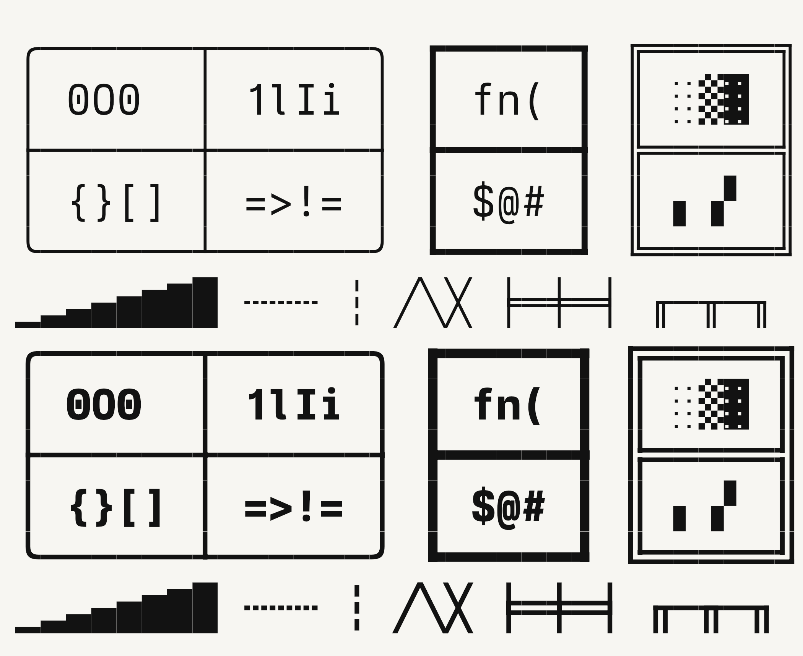

# Kerf


The logo is a square of material with three cuts: a vertical kerf frees the stem, two cuts run to the right side, and the wedge between them falls away. What is left is the K (`tools/logo.py`).

Kerf is an open source type family with four members:

- **Kerf Sans**: a sans serif with squared curves, horizontal cuts and square punctuation. Variable weight from 100 to 900.
- **Kerf Round**: geometric bowls with every vertex rounded, between Kerf Sans and Inter. Variable weight from 100 to 900.
- **Kerf Text**: the reading member, Inter moved toward PP Mori and away from Inter's tells: a lower x-height, smaller and tighter, wider capitals and round letters, a compact f, an l with a tail, a t cut at a slant, level cuts and no squaring. Variable weight from 100 to 900.
- **Kerf Mono**: the same letters fitted to a 0.625 em cell at even widths, with flagged i, l and j, a serif I, a long-flag 1, a centre-bar zero and generated box drawing. Variable weight from 100 to 700.

Kerf Sans, Round and Text also set 19 more scripts, from Devanagari and Arabic to Ethiopic and Khmer, with outlines merged from Google's Noto Sans (OFL), and Chinese, Japanese and Korean through the Kerf CJK companion fonts, so the proportional members set the languages of 99.6 percent of the world's people. See [SPEC.md](SPEC.md#other-scripts).

Every OpenType feature Inter has works in all four members, plus small capitals (`smcp`, `c2sc`) and, in Kerf Mono, code ligatures that keep every character in its own cell (`dlig`). See [SPEC.md](SPEC.md#opentype-features).

Kerf Sans is derived from [Inter](https://github.com/rsms/inter) by Rasmus Andersson. It moves Inter toward the geometry of Camber by Eduardo Manso. Kerf Mono follows the monospace tradition that Berkeley Mono also comes from. Neither Camber nor Berkeley Mono contributed any outlines: both were measured as references only. See [SPEC.md](SPEC.md) for every design decision and the numbers behind it.





**Status: v0.1, a generated draft.** Every glyph is produced by the transforms in `tools/`. Hand corrections, italics and hinting come next.

## Fonts

```
fonts/sans/KerfSans[wght].ttf
fonts/round/KerfRound[wght].ttf
fonts/text/KerfText[wght].ttf
fonts/cjk/KerfCJKSC[wght].ttf, KerfCJKJP[wght].ttf, KerfCJKKR[wght].ttf
fonts/mono/KerfMono[wght].ttf
```

## Building

Requires Python 3.11 or later and git.

```bash
python3 -m venv .venv
.venv/bin/pip install -r requirements.txt
tools/build.sh          # all members
tools/build.sh round    # Kerf Round only
tools/build.sh text     # Kerf Text only
tools/build.sh cjk      # the Kerf CJK companions
tools/build.sh sans     # one member
```

The build fetches Inter's sources at a pinned commit into `vendor/inter` and the Noto Sans fonts into `vendor/noto`, converts them to UFO, applies the Kerf transforms and compiles variable TrueType fonts with fontmake. A full build takes about ten minutes.

`tools/proof.py sans|mono|round|text|family` renders proof sheets to `build/proofs/`.

The specimen site at [kerf.kevinliu.studio](https://kerf.kevinliu.studio), with its [map of where Kerf writes](https://kerf.kevinliu.studio/map) and a [converter that shows any site in Kerf](https://kerf.kevinliu.studio/convert), lives in [Kerf-Website](https://github.com/Kevin-Liu-01/Kerf-Website). Check it out next to this repo, then `tools/build_site.py` writes the web fonts, `data.js` and `index.html` into it (set `KERF_SITE` to use another path). Pushing Kerf-Website deploys the site.

## Layout

| Path | Contents |
|---|---|
| `tools/kerf_build/profiles.py` | the parameters of Kerf Sans, Kerf Round and Kerf Text |
| `tools/build_sans.py` | Inter masters to a proportional member's masters (`sans`, `round` or `text`) |
| `tools/build_mono.py` | Kerf Sans masters to Kerf Mono masters |
| `tools/build_world.py` | merges 19 Noto scripts into a proportional member |
| `tools/build_cjk.py` | the Kerf CJK SC, JP and KR companions |
| `tools/kerf_build/outline.py` | point-preserving transforms: curve squaring, horizontal emboldening |
| `tools/kerf_build/fontops.py` | glyph swaps, resizing, composite re-seating, naming |
| `tools/kerf_build/boxdraw.py` | box drawing and block elements |
| `tools/build_site.py` | specimen site assets, written into Kerf-Website |
| `tools/build_map.py` | map data and coverage figures from General Translation's world language map data |

## License

Kerf is licensed under the [SIL Open Font License 1.1](OFL.txt). It is a modified version of Inter, which is also licensed under the OFL, and keeps Inter's copyright notice.
